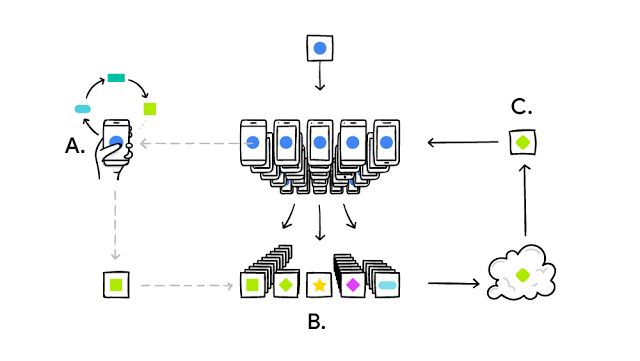
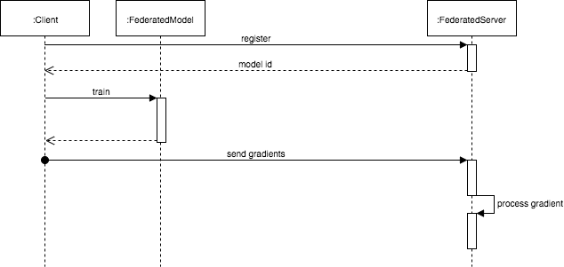

# Federated Learning with Android clients

## A naive approach

# Introduction

Ever since Google released the [paper](https://arxiv.org/pdf/1602.05629.pdf) and the corresponding [blog entry](https://research.googleblog.com/2017/04/federated-learning-collaborative.html) talking about how they used federated learning to delegate part of the training into mobile devices, I wanted to do something similar. Being a parent, a full-time worker and a self-student of machine learning did not leave me much time to focus on this particular project

In my opinion, Federated Learning is one of the most interesting developments in Machine Learning in 2017. It brings training to the clients which means distributing the effort among millions of devices while adding a level of security and privacy to the data that it is one of the biggest concerns in certain fields as health care

This project is a mere proof of concept and as such should be treated. It focuses on the moving pieces that a federated learning system contemplates rather than in model design, server strategies or even Android best practices. The important bit of security is also to be done.

I do think however there are enough attractive ideas in it to continue the development in the future

A very important outcome of this PoC is that it’s possible to use an **Android device to train** a (small) model with a (small) dataset. I have not doubts the restrictions we see today in the processing power and memory capacity will be vanishing as the technical specifications of our devices increase.

Training in the device opens an entire world of possibilities to IoT and mobile applications

# What is Federated Learning

First introduced by Google in April 2017, Federated Learning allows the clients (mobile devices) to learn how to make predictions by using a model that is trained collaboratively. Because each client uses its own set of data, there is no need to share it with a central server or other clients

The following diagram, took from Google’s blog entry, shows the flow that lies behind the idea of Federated Learning



Each client performs a training of the common model using local data (A). The updates to the local models are sent to a shared location (B) where they are processed generating a new model update that is, in turn, sent to all clients (C) 

The original paper used Tensorflow to power the training in the clients. However, making Tensorflow work for training in a mobile device is not an easy task. It required the team that develop Federated Learning to create a specific version (Tensorflow Lite) and, probably, an entire native interface for the Android client to communicate with it

Because the effort to create a custom Tensorflow version is too much for a single person with limited time, I decided to jump into DL4J

# Deeplearning4j

DL4J is a deep learning library written for Java (and Scala!) that relies on ND4J, a scientist computing library

Choosing DL4J for this PoC came as a natural decision once TF was discarded. It is (more or less) easy to integrate with Android and the Java API offers all a Machine Learning practitioner needs

It also claims to perform better than the standard Tensorflow available to everyone

# Components

### Assumptions

In this PoC there are a few assumptions made to simplify the development

The following table and points explain these assumptions

<table>
  <tr>
    <td>How it should be</td>
    <td>How it is in the PoC</td>
  </tr>
  <tr>
    <td>Client should hold its own unique dataset</td>
    <td>The dataset is the same for all clients. In order to simulate the clients having different datasets, there is a split of the baked-in dataset based on a configuration parameter (max_clients)</td>
  </tr>
  <tr>
    <td>Model would be served from the Federated Server</td>
    <td>To make things easier for the PoC, the models are defined in the Android app</td>
  </tr>
  <tr>
    <td>Transfer learning from curated models</td>
    <td>The PoC trains every model from scratch</td>
  </tr>
  <tr>
    <td>Model and gradients must be encrypted</td>
    <td>There is no encryption</td>
  </tr>
</table>


* Models: The PoC allows several clients to train models in the same session. The PoC can deal with this because the models and datasets used for testing purposes are very small.

    * Each client has hence an identifier that is used to select the subset of the dataset to use in the training

    * Real life applications would be a single client training one and only one model. There could be the case where a client would need to train a second model to compare it with the production one. They would use the entire dataset for training leaving the test and cross-validation sets for the server

    * Real life applications would have the model downloaded from the Federated Server

    * Real life applications would make use of transfer learning to take advantage of previous trainings by other clients

* Data sets. The data used in the training and evaluation of the models are very small. As the PoC allows the existence of more that one client, the dataset is divided into several subsets. This has been done to simulate the fact that every client would have a different local dataset

    * Real life applications would have a local own and distinctive dataset that remains in the client’s device

* It is perfectly possible to run this PoC in different devices against the same server. The effects are the same and you can see the real power of this system

## Federated Client

The Federated Client is an Android application that trains a common model and upload the computed gradients to the federated server.

The client decides when to update its local gradients by requesting a service to the server

## Federated Server

The Federated Server is in charge of processing the different gradients coming from the clients and serving them the results.

In this PoC, the communication between the clients and the server is initiated by the clients in both cases, that is, it’s the client that sends its local gradient and it’s the client that requests the server for an updated gradient

* A real life application would have a much richer interaction between the clients and the server starting by the server notifying the clients of the existence of updated gradients via notifications or any other mechanism

### Processing the gradients

Process of the gradients coming from the clients is probably the most strategical decision in a federated learning system. The PoC implements a simple approach consisting on calculating the average of the gradient stored by the server with the incoming from the client



# Encryption, security and privacy

The PoC does not implement any policy to encrypt the gradients sent by the clients to the server. There are projects that are putting a big effort to use [Homomorphic Encryption](https://en.wikipedia.org/wiki/Homomorphic_encryption) (i.e. OpenMined). By doing so it is almost impossible to know which data has been used by the client to do the training that generates the gradients that are uploaded.

The PoC would require a way of manipulating INDArrays using an HE implementation (i.e. Pallier)

# Implementation

## The Android Bit

The application can be improved in a thousand ways. It is not thought as a showcase of Android good practices (though you can get a few nice ideas). I consider it is a draft at the moment of writing this document

Since I consider this application as part of my curriculum, it will be improved in future iterations

The app has been architected using Clean Architecture and MVP for the presentation layer. There are open issues and branches to use Dependency Injection, move the rest of use cases still using callbacks to RxJava and a myriad of small details to polish and bring the app to a better state

## The Server

The Federated Server is very very simple and it’s being implemented using Jetty and Jersey with the corresponding DL4J libraries. Please note that I have not paid much attention to how to build and deploy the server beyond the limits of this PoC

# Code

This section highlights the parts of the code that deal with the main concepts used in both the client and the server

The most important bits of code in the system are related to how the gradients and weights are updated both in the client and the server

When the server receives a new gradient from a client, it executes the strategy to process it. In this PoC, this strategy consists on averaging the gradients.

```Java
@Override
public INDArray processGradient(INDArray averageFlattenGradient, INDArray gradient) {
   // Doing a very simple and not correct average
   // In real life, we would keep a map with the gradients sent by each model
   // This way we could remove outliers
   if (averageFlattenGradient == null) {
       averageFlattenGradient = gradient;
   } else {
       if (Arrays.equals(averageFlattenGradient.shape(), gradient.shape())) {
           logger.log("Updating average gradient");
           averageFlattenGradient = averageFlattenGradient.add(gradient).div(2);
       } else {
           logger.log("Gradients had different shapes");
       }
   }
   return averageFlattenGradient;
}
```
When a client requests the gradient from the server, this is the piece of code that updates the weights (called params in DL4J) for every model

```Java
<@Override
public void updateWeights(INDArray remoteGradient) {
   Log.d(TAG, "Updating weights with INDArray object");
   INDArray params = model.params(true);
   params.addi(remoteGradient);
}
```


# Installation and setup

There are two different projects in github to run this PoC:

* The server is located in [https://github.com/mccorby/FederatedServer](https://github.com/mccorby/FederatedServer)

* The client is located in [https://github.com/mccorby/FederatedAndroidTrainer](https://github.com/mccorby/FederatedAndroidTrainer)

I recommend to use IntelliJ for the server project. It is easier to run it from within this IDE

Modify the config.json to point your clients to the IP address where the server will run

There are currently two different models to train: Iris and Diabetes. The datasets for both of them are baked in into the application.

A typical execution would be as follows:

* Start the server by executing the class `JobQueueServer`. This class contains a `main` method that makes the server available in the port specified in its code
  * If there is a conflict with the port, change it in this line
  
   `Server jettyServer = new Server(9998);`

* Update the code of the client with the IP address of the server in the `config.json` file

   `"server_url": "http://192.168.0.33:9998/",`

* Choose the type of project in the `config.json`. Allowed values are `Iris` and `Diabetes`. More will be added soon

   `"model": "Iris",`

* There can be as many models as wanted in the app but to really feel how the federation of learners work it is better to install the app in different devices
  
* **Training only**

  * For training only, just stop the server. The client app will use the entire data set to train the model

# References

* Federated Learning

    * [https://research.googleblog.com/2017/04/federated-learning-collaborative.html](https://research.googleblog.com/2017/04/federated-learning-collaborative.html)

    * [https://arxiv.org/pdf/1602.05629.pdf](https://arxiv.org/pdf/1602.05629.pdf)

* Implementing HE in Python

    * [https://blog.n1analytics.com/distributed-machine-learning-and-partially-homomorphic-encryption-1/](https://blog.n1analytics.com/distributed-machine-learning-and-partially-homomorphic-encryption-1/)

* OpenMined

    * https://github.com/OpenMined

* Distributed Learning

    * [http://www.sciencedirect.com/science/article/pii/S2095809916309468](http://www.sciencedirect.com/science/article/pii/S2095809916309468)

* Installing DL4J in Android

    * [http://progur.com/2017/01/how-to-use-deeplearning4j-on-android.html](http://progur.com/2017/01/how-to-use-deeplearning4j-on-android.html)

* DL4J

    * [https://deeplearning4j.org](https://deeplearning4j.org)

* Homomorphic Encryption

    * https://en.wikipedia.org/wiki/Homomorphic_encryption

# Links

* [https://github.com/mccorby/FederatedAndroidTrainer](https://github.com/mccorby/FederatedAndroidTrainer)

* [https://github.com/mccorby/FederatedServer](https://github.com/mccorby/FederatedServer)

